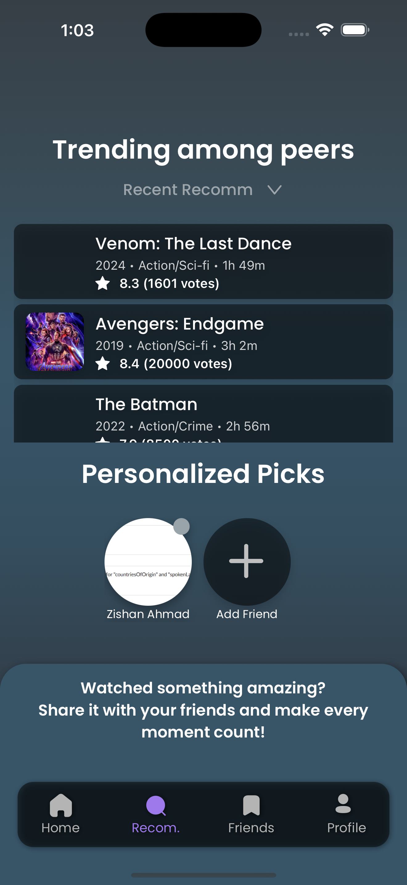
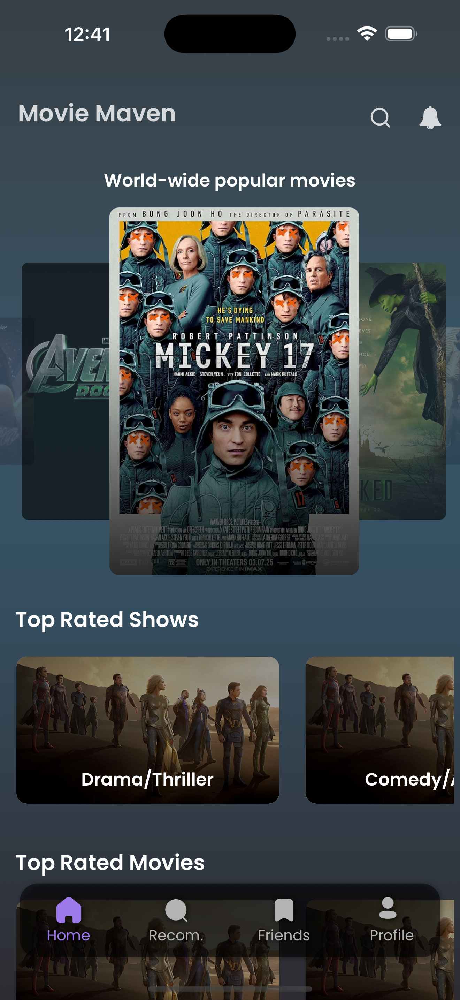

# **Movie Maven (MM-frontend)**

Movie Maven is a React Native application designed to provide users with personalized movie recommendations, trending picks, and a seamless social experience to share and explore movies with friends. This project leverages modern technologies like Expo Router, React Native Reanimated, and React Query to deliver a high-performance and visually appealing mobile application.

---

## 📸 Screenshots

### Search Moive or Shows



### Post Recommendations



---

## 🎥 Demo

[▶️ Watch Demo](./docs/assets/demo.mp4)

## **Features**

- **Personalized Recommendations**: Get movie suggestions tailored to your preferences.
- **Trending Movies**: Explore movies trending among peers.
- **Social Integration**: Follow friends, view their recommendations, and share your favorite picks.
- **Search Functionality**: Search for movies by title and discover detailed information.
- **Interactive UI**: Smooth animations and gesture-based interactions.
- **Offline Support**: Handle network errors gracefully with fallback states.
- **Cross-Platform**: Works seamlessly on iOS, Android, and Web.

---

## **Tech Stack**

### **Frontend**

- **React Native**: For building the mobile application.
- **Expo Router**: For file-based routing and navigation.
- **React Query**: For efficient server state management.
- **React Native Reanimated**: For smooth animations and gestures.
- **NativeWind**: Tailwind CSS for styling in React Native.
- **TypeScript**: For type safety and better developer experience.

### **Backend**

- **API Integration**: The app communicates with a backend API for fetching movie data, user profiles, and recommendations.

## 🔗 Backend Repository

The backend API powering Movie Maven is available here:

👉 [MM-backend GitHub Repository](https://github.com/zishancoder/MM-backend)
---

## **Installation**

1. Clone the repository:

   ```bash
    git clone https://github.com/Pratham16112002/MM-frontend.git

    cd MM-frontend
    ```

2. ```bash
    yarn install
        # or
    npm install
    ```

3. Start the development server

    ```bash
    expo start
    ```

## **Contributing**

We welcome contributions! Please follow these steps:

1. **Fork the repository**:
   - Click the "Fork" button at the top right of this repository to create your own copy.

2. **Clone your forked repository**:

   ```bash
   git clone https://github.com/your-username/MM-frontend.git
   cd MM-frontend
   ```

3. **Create a new branch**:

   ```bash
   git checkout -b feature/your-feature-name
   ```

4. **Make your changes**:

5. **Commit your changes**:

   ```bash
    git commit -m "Add your descriptive commit message here"
    ```

6. **Push your changes to your forked repository**:

   ```bash
   git push origin feature/your-feature-name
   ```

7. **Open your pull request**

### **Prerequisites**

- Node.js (>= 16.x)
- Expo CLI (>= 6.x)
- Yarn or npm

## **Acknowledgments**

- **Expo**: For providing a robust framework for React Native development.
- **React Query**: For simplifying server state management.
- **React Native Reanimated**: For enabling smooth animations and gestures.
- **NativeWind**: For seamless Tailwind CSS integration in React Native.
- **TypeScript**: For ensuring type safety and improving developer productivity.
